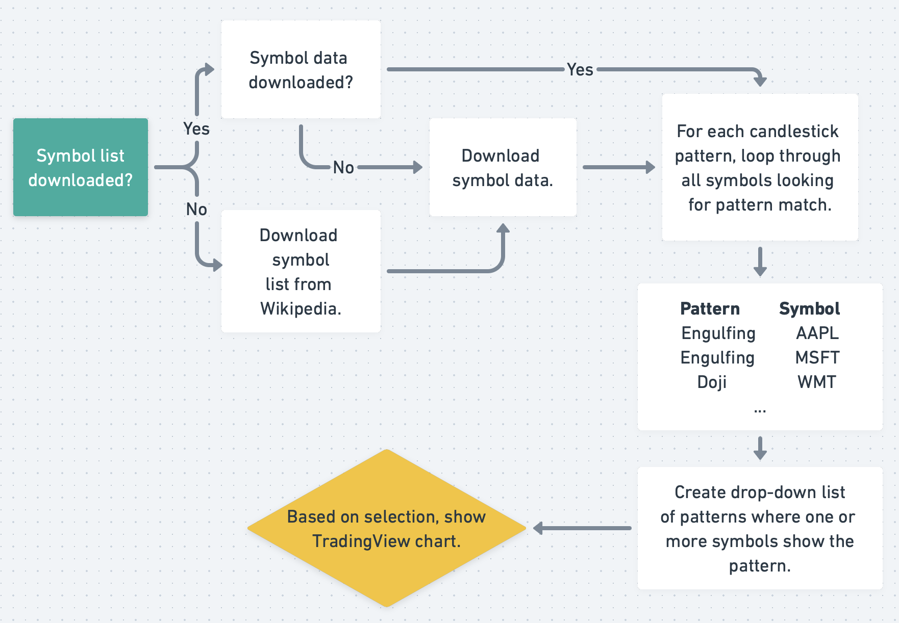
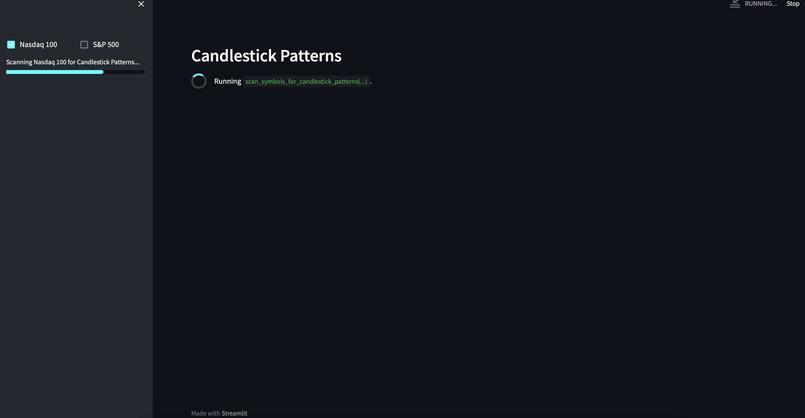
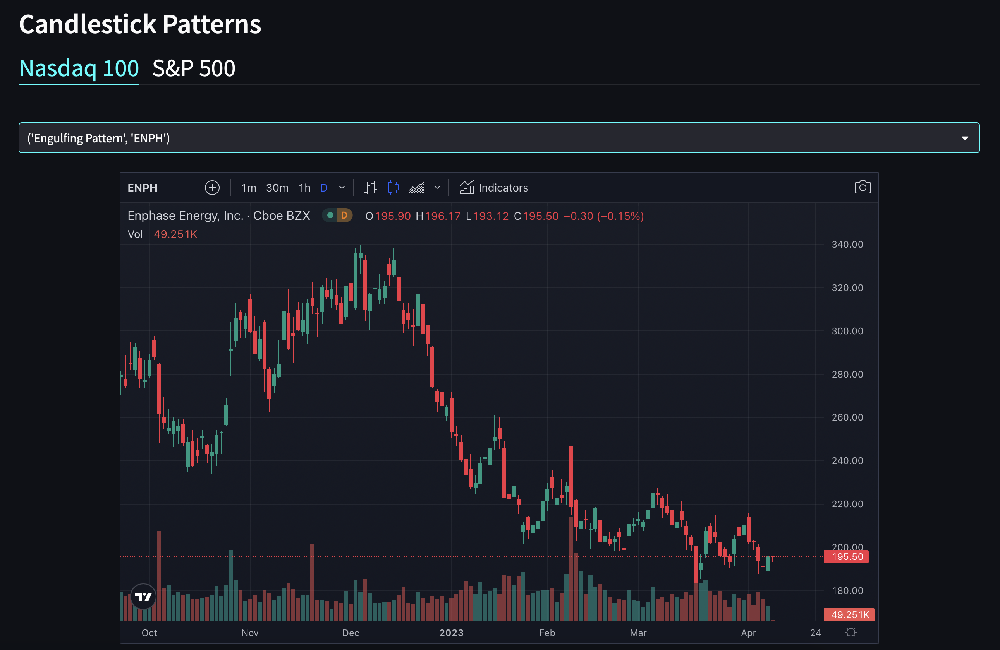
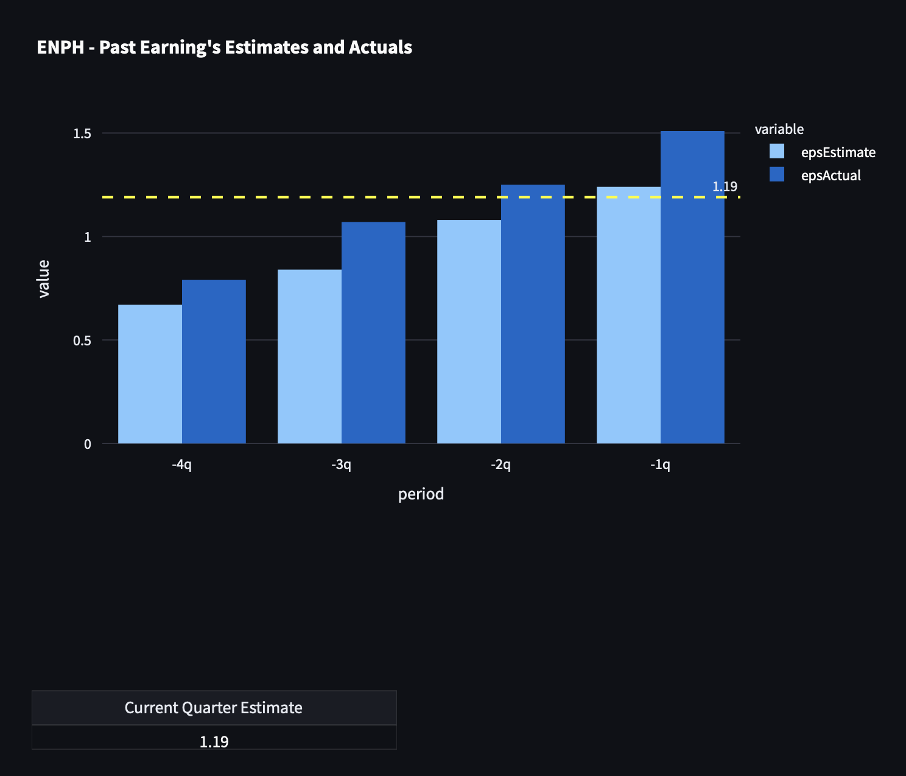
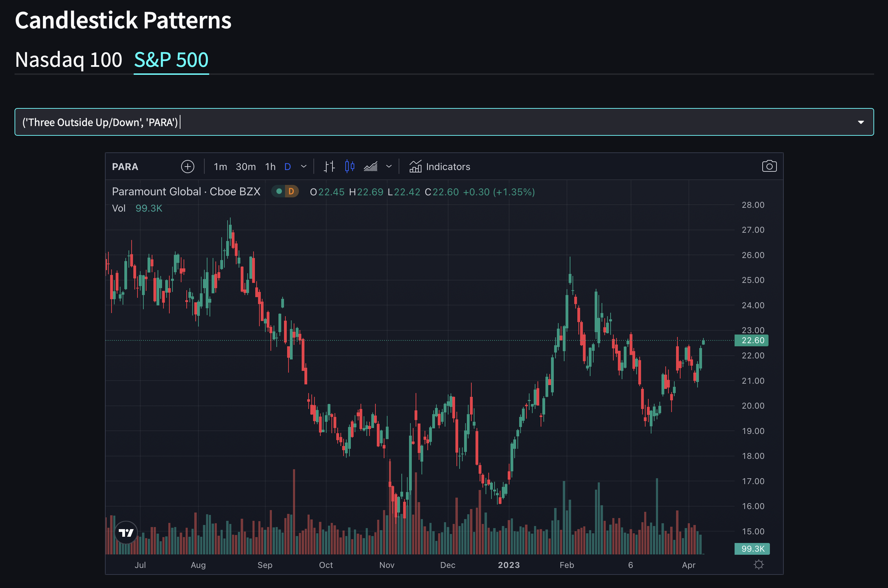
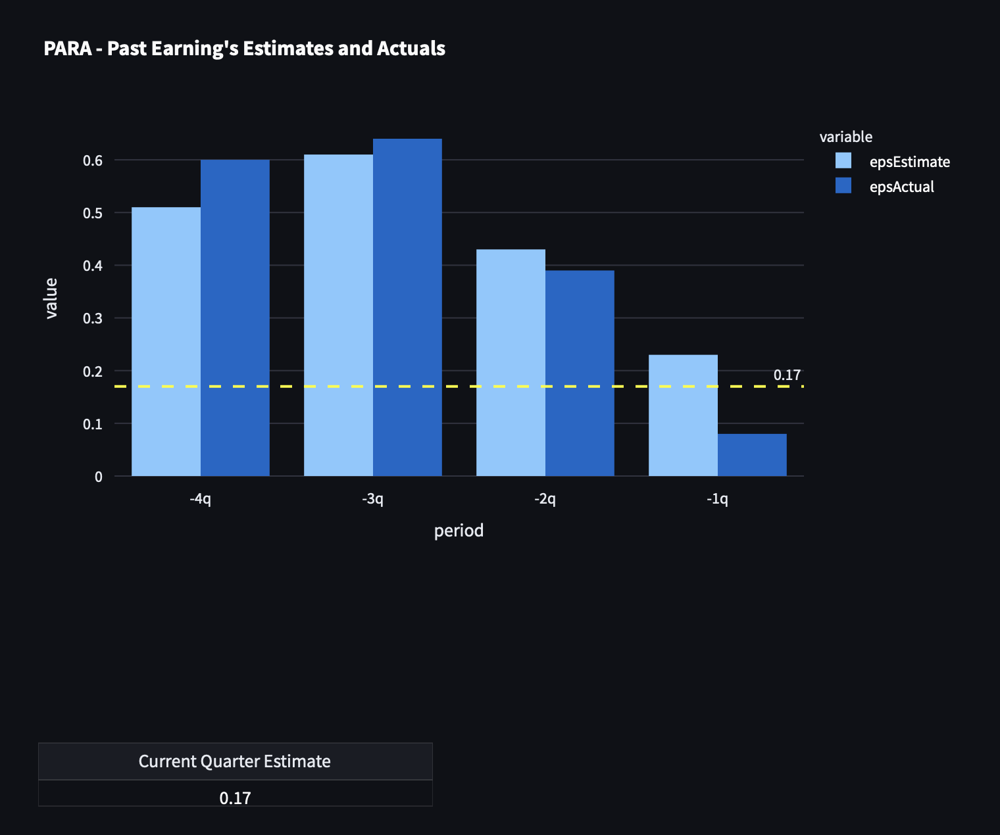

# Python Candlestick Pattern Matching

This project scans all the symbols in the Nasdaq 100 and S&P 500 for candlestick patterns. Symbols showing candlestick patterns are viewable as a [TradingView](http://TradingView.com) chart in a webapp.

This project was created in Python and runs as a web application via the Python web-framework [Streamlit](https://Streamlit.io).


## Application Flow

### Download the Data

* Download list of symbols in the Nasdaq 100 and S&P 500 from WikiPedia.
* For each symbol, download 10 days of data (open, high, low, close) using Python package [yfinance](https://pypi.org/project/yfinance/)
* For each symbol, download earnings data using Python package [yahooquery](https://yahooquery.dpguthrie.com).

### Scan Stock Symbols for Candlestick Patterns

* For each of the 60+ candlestick patterns, scan all the symbols looking for pattern matches.
* Create list of patterns and the relevant symbols.

### Streamlit Webapp

With a list of candlestick patterns and symbols matching those patterns:

* Create drop-down lists in Streamlit with name of candlestick pattern and the symbol.
* Upon selection of a pattern/symbol from the drop-down, load a TradingView chart.
* Create plot of earnings data using [Ploty Express](https://plotly.com/python/plotly-express/).



### Screenshots

  

  

  

  




## Candlestick Pattern Matching in Python Using TA-Lib

[TA-Lib](https://ta-lib.org) is a Python wrapper based on [Cython](https://cython.org/) and includes the following:

* 150+ indicators such as ADX, MACD, RSI, Stochastic, Bollinger Bands, etc. 
* 60+ candlestick pattern recognition
* Open-source API for C/C++, Java, Perl, Python and 100% Managed .NET


## Install Python Requirements

```bash
pip install -r requirements
```

## Usage

```bash
$ streamlit main.py
```

## Ideas for Updates

* Store all data in Snowflake or a similiar cloud-based solution.
* Add additional support for Streamlit caching.
* Add asynchronous downloading of data.

## TradingView Projects

If you're a trader/investor, I've written many techical indicators, both open/closed source that might be of interest:
[TradingView Indicators](https://www.tradingview.com/u/JohnMuchow/#published-scripts).

## License

This project is licensed under the MIT License. See the LICENSE file for more details.


